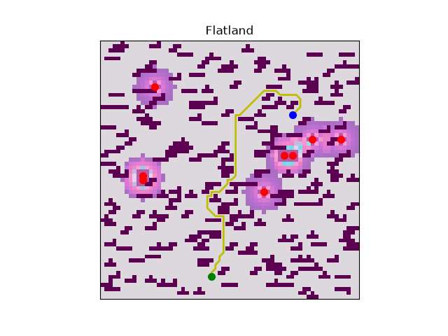

# Flatland
Flatland is a 2D grid world simulator where a hero point robot evades multiple enemies while trying to find a goal point.

## Requirements & Building
This is a hybrid package that uses both Python and Rust, so both [uv](https://docs.astral.sh/uv/getting-started/installation/) and [cargo](https://rust-lang.org/tools/install/) will be needed to run the game.



## Setting up the Environment
Make sure both of these commands are run in the project root!
1. initialize the environment with uv 
```bash
uv sync
```
2. build the rust A* implementation 
```bash
uv run maturin develop --release
``` 

## Running the Game
The simplist way to run the game is by invoking the uv shortcut:
```bash
uv run flatland
```
There are also many ways to run Flatland with different settings.

| Argument | Short form | Type | Default | Description |
|---|---:|---|---:|---|
| `--coverage` | `-c` | `float` | `20.0` | Percentage of the field covered by obstacles |
| `--seed` | `-r` | `int` | `None` | Random seed for reproducible games |
| `--speed` | `-ms` | `int` | `500` | Animation update interval in milliseconds |
| `--size` | `-s` | `int` | `64` | Width and height of the square grid |
| `--version` | `-v` | `str` | `"py"` | Path planner implementation: `py` or `rs` |
| `--enemies` | `-e` | `int` | `10` | Number of enemies |
| `--headless` | | flag | `False` | Run without displaying the Matplotlib window |
| `--data` | | flag | `False` | Enable JSONL game-state logging |
| `--frames` | | `int` | `1000` | Number of frames to run in headless mode |

### Some cool examples to try out

Results in a null game
```bash
uv run flatland --seed 350
```

## File Directory 
```
flatland/
├── .gitignore
├── .python-version
├── Cargo.lock
├── Cargo.toml
├── README.md
├── plotting.py
├── pyproject.toml
├── trials.py
├── uv.lock
├── flatland/
│   ├── __init__.py
│   ├── a_star.py
│   ├── costmap.py
│   ├── game_logic.py
│   ├── game_logging.py
│   ├── helpers.py
│   └── main.py
└── src/
    └── planner.rs
```

### Notable Files:
- `src/planner.rs` contains A* written in Rust
- `main.py` contains the main update function
- `a_star.py` contains A* written in Python
- `game_logic.py`enemy behavior and some other game logic

## Libraries Used
Here is a list of the libraries I used for this project.
### Python

- [NumPy](https://numpy.org/) - Numerical arrays, random generation, and grid data.
- [Matplotlib](https://matplotlib.org/) - Game visualization and animation.
- [Colorama](https://pypi.org/project/colorama/) - Colored terminal output.
- [Notify2](https://pypi.org/project/notify2/) - Desktop notifications for trial runs.
- [dbus-python](https://pypi.org/project/dbus-python/) - D-Bus integration used by desktop notifications.
- [Maturin](https://www.maturin.rs/) - Builds and installs the Rust-based Python extension.

### Rust

- [PyO3](https://pyo3.rs/) - Creates Python bindings for the Rust code.
- [rust-numpy](https://github.com/PyO3/rust-numpy) - Accesses NumPy arrays from Rust.
- [ordered-float](https://crates.io/crates/ordered-float) - Provides ordering for floating-point values in the priority queue.
- [heapq](https://crates.io/crates/heapq) - Priority queue implementation for the Rust A* planner.
